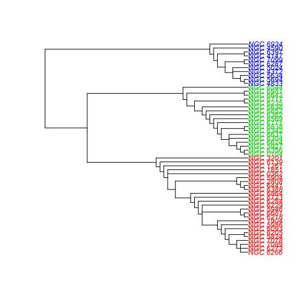
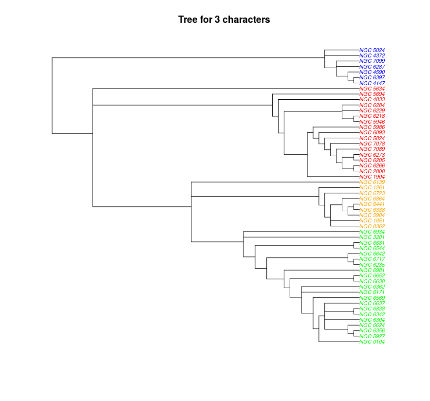

```{r setup, include=FALSE}
knitr::opts_chunk$set(echo = TRUE, cache = TRUE)
```

## Purpose

Code for Bayesian nonparametric presentation at Stat4Astro school, Autrans.
https://stat4astro2017.sciencesconf.org/

## Prerequisites

Have R and RStudio installed on your laptop:

 * R https://cran.r-project.org/bin/windows/base/
 * RStudio Desktop https://www.rstudio.com/products/rstudio/download/
 
Also, have packages installed as described here:

 * https://github.com/jarbel/install-R-packages-Stat4Astro
 
## Charging packages

```{r}
needed_packages = c("ggplot2", "hexbin", "viridis", "gridExtra", "rgl", "readr", "DPpackage", "BNPdensity", "abind", "mvtnorm", "ggpubr") # , add "ggpubr" and run again

# nice trick in order to install only missing packages
new.packages <- needed_packages[!(needed_packages %in% installed.packages()[,"Package"])]
if(length(new.packages)) install.packages(new.packages)

# and then to load them all
lapply(needed_packages, require, character.only = TRUE)

download.file(url = "http://wrap.warwick.ac.uk/71934/1/mcclust.ext_1.0.tar.gz", 
              destfile = "mcclust.ext_1.0.tar.gz")
install.packages("mcclust.ext_1.0.tar.gz", repos = NULL, type = "source")
file.remove("mcclust.ext_1.0.tar.gz")
load("mcclust.ext")
```

## Importing data

We consider datasets from the following articles, available in the data folder:

1) Didier Fraix-Burnet (2016). CONCEPTS OF CLASSIFICATION AND TAXONOMY PHYLOGENETIC CLASSIFICATION
Statistics for Astrophysics: Clustering and Classification
D. Fraix-Burnet & S. Girard
EAS Publications Series, Vol. 77, 2016
  * https://arxiv.org/pdf/1606.01631.pdf
  
2) Ibata, R., Sollima, A., Nipoti, C., Bellazzini, M., Chapman, S., and Dalessandro, E. (2011). The globular cluster ngc 2419: a crucible for theories of gravity. The Astrophysical Journal, 738(2):186.
  * https://arxiv.org/pdf/1106.4909.pdf

```{r}
data1 <- read_delim("data/GC4c_groups.dat", 
    " ", escape_double = FALSE, trim_ws = TRUE)
names(data1)[3] = c("FeH")
names(data1) # "GC"    "logTe" "FeH"   "MV"    "Age"  "Grp4c" "Grp3c"
str(data1)
attach(data1)
View(data1)
```

Four covariates were extracted from star spectra:

  * logTe
  * Fe/H
  * MV
  * Age
  

### Visualizing data

```{r}
plot3d(logTe, FeH, MV, type="s", size=.5) # , col=as.numeric(v_success)+2
# subid <- currentSubscene3d()
rglwidget() # elementId="plot3drgl"
```

Groups obtained in previous analysis by Didier Fraix-Burnet:
Statistics for Astrophysics: Clustering and Classification
D. Fraix-Burnet & S. Girard
EAS Publications Series, Vol. 77, 2016






The groups can be visualized on the data:
```{r}
rgl.close()
mfrow3d(nr = 1, nc = 2, sharedMouse = TRUE)  
plot3d(logTe, FeH, MV, type="s", size=2, col=as.numeric(Grp4c))
plot3d(logTe, FeH, MV, type="s", size=2, col=as.numeric(Grp3c))
rglwidget()
```

```{r}
# 1) Data from Fraix-Burnet
# take only variables "logTe" "FeH"   "MV" (dismiss age)
data = data1[, c(2,3,4)]
names(data)
```

2) Data Ibata et al.

```{r}
data2 <- read.table("data/globular_cluster_data.txt", head = TRUE)
```

```{r}
# 1) Data from Fraix-Burnet
# take only variables "logTe" "FeH"   "MV" (dismiss age)
data = data1[, c(2,3,4)]
names(data)

# 2) Data from Ibata et al.
# take only variables V, FeH and R
data <- data2[, c(10,14,15)]
names(data)
plot(data[,c(1,2)])
pnt <- c(107, 110, 188)
data <- data[-pnt,]
plot(data)
head(data)
```

Some (cooler) visualization

```{r}
col <- '#0073C2FF'
spVF <- ggscatter(data, x = "V", y = "FeH", color = col, size = 3, alpha = 0.6)+ border()
spRF <- ggscatter(data, x = "R", y = "FeH", color = col, size = 3, alpha = 0.6)+ border()
spRV <- ggscatter(data, x = "R", y = "V", color = col, size = 3, alpha = 0.6)+ border()

Vplot <- ggdensity(data, "V", fill = col)
Rplot <- ggdensity(data, 'R', fill = col)
Fplot <- ggdensity(data, "FeH", fill = col)+
  rotate()

Vplot <- Vplot + clean_theme()
Rplot <- Rplot + clean_theme()
Fplot <- Fplot + clean_theme()
ggarrange(Vplot, Rplot, NULL,
          spVF, spRF, Fplot,
          NULL, spRV, NULL,
          ncol = 3, nrow = 3,  align = "hv",
          widths = c(2, 2, 1), heights = c(1, 2, 2))
```


## Dirichlet process 1: Stick-breaking representation


```{r}
# Return a vector of weights drawn from a stick-breaking process
  # with dispersion `alpha`.
  #
  # Recall that the kth weight \pi_k is
  #   \pi_k = \beta_k * (1 - \beta_1) * (1 - \beta_2) * ... * (1 - \beta_{k-1})
  # where each \beta_i is drawn independently from a Beta distribution
  #   \beta_i ~ Beta(1, \alpha)
  stick_breaking_process = function(num_weights, alpha) {
    betas = rbeta(num_weights, 1, alpha)
    remaining_stick_lengths = c(1, cumprod(1 - betas))[1:num_weights]
    weights = remaining_stick_lengths * betas
    weights
  }
```

Try to repeat the following sampling of stick-breaking weights by changing alpha parameter

```{r}
num_weights = 50

draw_stick_breaking = function(alpha){
labels = 1:num_weights
locations = rnorm(num_weights)
SB_weights = stick_breaking_process(num_weights, alpha)
df <- data.frame(labels, locations, SB_weights)

# plotting the SB weights in order of appearance (stochastically decreasing)
order_plot = ggplot(df, aes(labels,SB_weights, fill = as.factor(labels))) + geom_bar(stat = "identity")

# plotting the SB weights at assigned locations (Dirac masses)
location_plot = ggplot(df, aes(locations,SB_weights, fill = as.factor(labels))) + geom_bar(stat = "identity", width = .1)

grid.arrange(order_plot, location_plot, ncol=2)
}
```


```{r, SB, fig.height=6, fig.width=20, out.width = "150%"}
draw_stick_breaking(1)
draw_stick_breaking(3)
draw_stick_breaking(10)
draw_stick_breaking(50)
```

 
## Dirichlet process 2: Polya Urn / Chinese Restaurant process

Code for a Polya Urn Model:

```{r}
# Return a vector of `N_ball` ball colors from a Polya Urn Model
# with precision parameter `alpha`
# sampling from a specified base measure (color) distribution.
  polya_urn_model = function(base_measure, N_ball, alpha) {
    balls = c()
  
    for (i in 1:N_ball) {
      if (runif(1) < alpha / (alpha + length(balls))) {
        # Add a new ball color.
        new_color = base_measure()
        balls = c(balls, new_color)
      } else {
        # Pick out a ball from the urn, and add back a
        # ball of the same color.
        ball = balls[sample(1:length(balls), 1)]
        balls = c(balls, ball)
      }
    }
  
    balls
  }
```


```{r}
# Sample run, using the Gaussian N(0,1) as the base color distribution.

# Number of customers
N_ball = 100

# with alpha = 1
polya_sample = polya_urn_model(function() rnorm(1), N_ball, 1)
rev(sort(table(polya_sample)))

# with alpha = 10
polya_sample = polya_urn_model(function() rnorm(1), N_ball, 10)
rev(sort(table(polya_sample)))

# with alpha = 100
polya_sample = polya_urn_model(function() rnorm(1), N_ball, 100)
rev(sort(table(polya_sample)))
```


## Dirichlet process 3: Marginal distribution

### Illustration of Dirichlet marginals in 1D space


```{r}
# Polya Urn draws for varying parameter alpha values
alpha_vect = c(0.1, 1, 10, 100, 1000)
N_urns = 1
N_draws = 100
# N_xaxis = 200
# x_axis = seq(-3,3,length = N_xaxis)
result = NULL
for(u in 1:N_urns){
  for(alpha in alpha_vect){
    PU = polya_urn_model(function() rnorm(1), N_draws, alpha)
    new_draw = cbind(PU, alpha, u)
    result = rbind(result, new_draw)
  }
}
result = as.data.frame(result)
names(result) = c("PU", "alpha", "urn_number")
plot1 =  qplot(data = result, PU, binwidth = 10) + facet_grid(.~alpha, labeller =  label_bquote(alpha == .(alpha))) + 
    aes(color = as.factor(alpha))
plot2 =  qplot(data = result, PU, binwidth = 3) + facet_grid(.~alpha, labeller =  label_bquote(alpha == .(alpha))) + 
    aes(color = as.factor(alpha))
plot3 =  qplot(data = result, PU, binwidth = 1) + facet_grid(.~alpha, labeller =  label_bquote(alpha == .(alpha))) + 
    aes(color = as.factor(alpha))
plot4 =   qplot(data = result, PU, binwidth = .5) + facet_grid(.~alpha, labeller =  label_bquote(alpha == .(alpha))) + 
    aes(color = as.factor(alpha))
```


```{r, fig.height=3, fig.width=10, out.width = "150%"}
plot1
plot2
plot3
plot4
```


### Illustration in 2D


```{r}
# Return a vector of `N_ball` ball colors from a Polya Urn Model
# with dispersion `alpha`
# sampling from a specified base measure (color) distribution.
  polya_urn_model_2D = function(base_measure, N_ball, alpha) {
    balls = NULL
  
    for (i in 1:N_ball) {
      if (runif(1) < alpha / (alpha + length(balls))) {
        # Add a new ball color.
        new_color = base_measure()
        balls = cbind(balls, new_color)
      } else {
        # Pick out a ball from the urn, and add back a
        # ball of the same color.
        ball = balls[, sample(1:(dim(balls)[2]), 1)]
        balls = cbind(balls, ball)
      }
    }
    balls
  }
```


```{r}
# Sample run, using the Gaussian N(0,1) as the base color distribution.
res = polya_urn_model_2D(function() rnorm(2), 10000, 1000)
result = as.data.frame(t(res))

names(result) = c("x","y")
g = ggplot(result, aes(x,y))  + coord_fixed() + scale_fill_viridis(option = "magma")
plot1 = g + geom_bin2d(binwidth = c(1,1))
plot2 = g + geom_hex(binwidth = c(.5,.5)) 
plot3 = g + stat_density2d(aes(fill = ..level..), geom = "polygon", n = 100)
```

```{r, fig.height=3, fig.width=10, out.width = "150%"}
grid.arrange(plot1, plot2, plot3, ncol=3)
```

## Dirichlet Process Mixture Model

Some density plots:

```{r}
# Polya Urn draws for varying parameter alpha values
alpha_vect = c(0.1, 1, 10, 100, 1000)
N_urns = 5
N_draws = 100
N_xaxis = 200
x_axis = seq(-3,3,length = N_xaxis)
result = NULL
for(u in 1:N_urns){
  for(alpha in alpha_vect){
    PU = polya_urn_model(function() rnorm(1), N_draws, alpha)
    res = mapply(function(mean) dnorm(x_axis, rep(mean,N_xaxis), rep(0.5,N_xaxis)), PU)
    res = apply(res, 1, mean)
    new_draw = cbind(res, x_axis, alpha, u)
    result = rbind(result, new_draw)
  }
}
result = as.data.frame(result)
names(result) = c("density", "x", "alpha", "urn_number")
q = qplot(data = result, y = density, x = x, geom = c("line","area")) + facet_grid(alpha ~ urn_number, labeller =  label_bquote(alpha == .(alpha))) + aes(color = as.factor(alpha))
```

```{r, out.width = "150%"}
q
```

## Mixtures with DPpackage


```{r}
source('src/function.R')
```

```{r}
# generate the grids to evaluate the densities for data and datal

grid <- expand.grid(seq(range(data[,1])[1]-.1 * diff(range(data[,1])),
                        range(data[,1])[2]+.1 * diff(range(data[,1])), length.out = 40),
                    seq(range(data[,2])[1]-.1 * diff(range(data[,2])),
                        range(data[,2])[2]+.1 * diff(range(data[,2])), length.out = 40),
                    seq(range(data[,3])[1]-.1 * diff(range(data[,3])),
                        range(data[,3])[2]+.1 * diff(range(data[,3])), length.out = 40))

#--------------------#
#   Run the models   #
#--------------------#

# MCMC_output_saved <- MCMCcoolMulti(data = as.matrix(data), grid = grid, nsim = 3000, nburn = 1000, theta = 1,
#                            k0 = 1, m0 = colMeans(data), nu0 = 5, Lambda0 = var(data) / 4,
#                            t1 = 2, t2 = 1, m1 = colMeans(data), m2 = var(data)/4,
#                            b1 = 5, b2 = solve(var(data)) * 4, k1 = 2, k2 = 2)

# save(MCMC_output_saved, file = "data/MCMC_output_saved.Rdata")
# load(file = "data/MCMC_output_saved_short.Rdata")
load(file = "data/MCMC_output_saved.Rdata")

str(MCMC_output_saved)
MCMC_clustering = MCMC_output_saved[[2]]
View(MCMC_clustering)
str(MCMC_clustering)
# dens <- array(colSums(est1_data[[1]])/5000, dim = c(40,40,40))
```

## Cluster estimation

### Mode a posteriori (MAP) estimator

```{r}
str(MCMC_clustering)
# MCMC_clustering_factor = apply(X = MCMC_clustering, MARGIN = 2, FUN = paste0)
MCMC_number_cluster = apply(X = MCMC_clustering, MARGIN = 1, FUN = max)
head(MCMC_number_cluster)
plot(MCMC_number_cluster, type = 'l')
MCMC_table = table(MCMC_number_cluster)
hist_number_cluster = hist(MCMC_number_cluster)
str(hist_number_cluster)
which.max(MCMC_table) # MAP estimator for K
# mean(MCMC_table)
# str(MCMC_table)
MCMC_alpha = MCMC_output_saved[[3]]
hist(MCMC_alpha)
mean(MCMC_alpha)
plot(MCMC_alpha, type ='l')
```

### A closer look at the clustering via adequate loss function

```{r}
posterior_similarity_matrix = comp.psm(MCMC_clustering)
str(posterior_similarity_matrix)
View(posterior_similarity_matrix)
galaxy_variation_information=minVI(posterior_similarity_matrix)
summary(galaxy_variation_information)
str(galaxy_variation_information)
galaxy_variation_information$cl # optimal cluster with respect to Variation of Information

```

